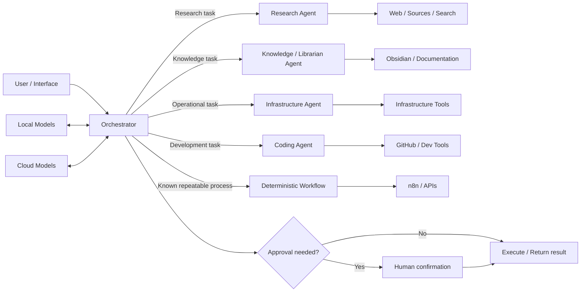
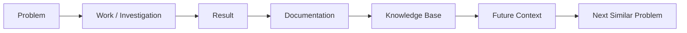

# Architecture

## Overview

The system is built as a small collection of specialized AI roles around a central orchestrator.

The architecture is intentionally hybrid:

- deterministic automation for predictable work,
- specialized agents for tasks that need interpretation,
- local and cloud models selected by task,
- structured tool access through APIs and connectors,
- and explicit human approval boundaries.

The goal is not maximum autonomy. The goal is **useful autonomy with understandable boundaries**.

## High-level architecture

## 1. Orchestrator

The orchestrator is the control layer.

It receives a request and decides how it should be handled. A useful routing decision usually includes five questions:

1. **What is the actual intent?**
2. **Is this a known workflow or an open-ended problem?**
3. **Which specialist needs to handle it?**
4. **Which tools and model class are appropriate?**
5. **Does any step require explicit approval?**

The orchestrator should keep its own role relatively small. It coordinates; it should not accumulate every specialist instruction and every piece of domain context.

## 2. Specialized agents

### Research agent

Optimized for discovery and synthesis rather than operational execution.

Typical tasks:

- compare technologies,
- investigate a technical problem,
- collect sources,
- summarize long material,
- identify trade-offs,
- prepare a shortlist for testing.

Its output is usually a recommendation, brief or structured note rather than a direct infrastructure change.

### Knowledge / librarian agent

Responsible for turning temporary conversations into durable knowledge.

Typical tasks:

- retrieve relevant notes,
- connect new findings with existing projects,
- normalize documentation,
- prepare runbooks,
- summarize completed work,
- reduce duplicated information.

This role helps keep the knowledge base useful instead of allowing it to become a passive archive.

### Infrastructure agent

Handles operational reasoning around self-hosted services, containers, Linux and networking.

Typical tasks:

- inspect symptoms and logs,
- propose diagnostic steps,
- interpret command output,
- narrow likely causes,
- prepare safe remediation steps,
- turn solved incidents into runbooks.

A key design rule is that diagnosis and action are separate. The agent may be able to propose a change without being allowed to apply it automatically.

### Coding agent

Handles software and repository work.

Typical tasks:

- understand a codebase,
- find the relevant implementation area,
- propose a change,
- debug failures,
- prepare or review patches,
- work with Git history,
- keep documentation aligned with implementation.

The coding agent is part of a larger workflow rather than an isolated code generator. Requirements, operations and documentation can all feed into its context.

## 3. Deterministic workflows

Not every problem should become an agent.

If a task has stable inputs, clear rules and predictable outputs, a deterministic workflow is usually preferable.

Examples:

- scheduled data collection,
- moving structured information between systems,
- notifications,
- simple health checks,
- known file transformations,
- repeatable API calls.

Tools such as n8n, scripts and direct API integrations are used for this layer.

The practical rule is:

> If the same decision can be expressed as a reliable rule, remove the LLM from that part of the workflow.

This reduces cost, latency and unpredictable behavior.

## 4. Model routing

The architecture does not assume that one model should handle every task.

### Local models

Preferred when one or more of the following matter:

- privacy,
- local-only data,
- low-latency interaction,
- offline availability,
- high-volume lightweight requests,
- tight integration with local services.

### Cloud models

Preferred when the task benefits from:

- stronger reasoning,
- advanced coding ability,
- long context,
- high-quality multimodal understanding,
- specialized tool support.

The model is treated as a component chosen for the task, not as the identity of the system.

## 5. Tool layer

Agents interact with external systems through constrained interfaces rather than arbitrary unrestricted access.

Examples include:

- MCP tools,
- application APIs,
- GitHub,
- knowledge-base integrations,
- workflow automation,
- local service APIs.

The tool layer is where capability and risk meet, so permissions should be narrower than the model's reasoning capability.

## 6. Human-in-the-loop boundary

Human approval is part of the architecture.

Examples of actions that should normally require confirmation include:

- destructive infrastructure changes,
- deleting or replacing important data,
- sending messages externally,
- publishing content,
- modifying production systems,
- security-sensitive configuration changes,
- actions with financial or account impact.

Read-only analysis and low-risk drafting can be more autonomous.

This separation allows agents to do useful preparation without giving them unnecessary control.

## 7. Knowledge feedback loop

A solved problem should make the system better for the next similar problem.

Examples:

- a network incident becomes a troubleshooting runbook,
- a research project becomes a decision note,
- a repeated coding pattern becomes project documentation,
- a manual process becomes an n8n workflow.

## 8. Failure containment

The system is designed under the assumption that models can be wrong.

Useful safeguards include:

- separating read and write capabilities,
- limiting tool scope,
- explicit approvals,
- preserving logs and version history,
- using Git for reversible changes,
- preferring dry-runs where possible,
- turning repeated procedures into deterministic automation.

The architecture therefore optimizes for **recoverability and visibility**, not blind autonomy.

## 9. Current direction

Areas currently being explored include:

- better semantic retrieval,
- RAG over personal technical knowledge,
- lightweight local models,
- multimodal input,
- richer agent-to-tool interfaces,
- long-running task coordination,
- clearer policy boundaries for autonomous actions.

The architecture is intentionally modular so individual models, tools and workflows can change without redesigning the whole system.
