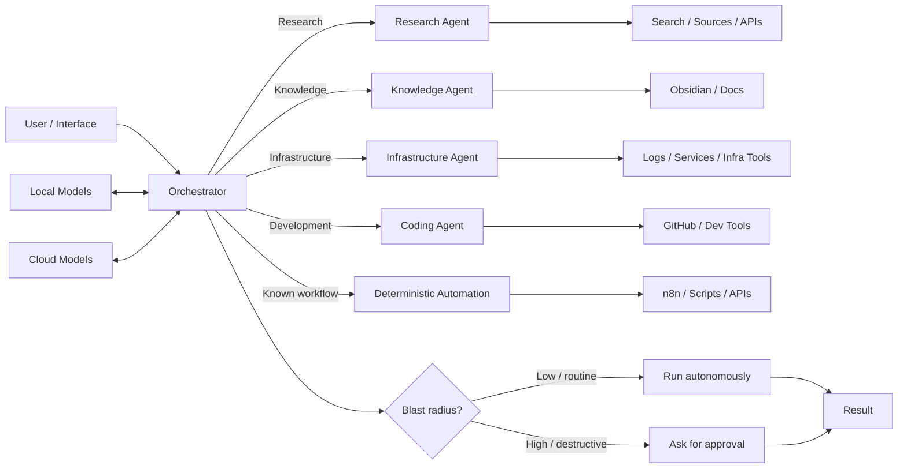
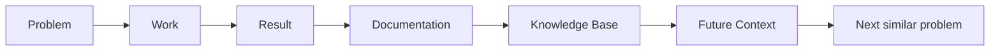

# Architecture

This is the slightly more technical version of the README.

The system is built around one idea:

> Let agents handle context. Let deterministic systems handle rules. Let humans step in only when the consequences justify it.

## High-level map



## 1. Orchestrator

The orchestrator is the router.

Its job is to answer a few boring but important questions:

1. What is the actual task?
2. Is this a known workflow or a fuzzy problem?
3. Which agent should own it?
4. Which model is the best fit?
5. Which tools does it need?
6. Can it run safely on its own?

The orchestrator should stay relatively lean.

If every domain rule, every tool instruction and every bit of context lives in one place, the system slowly turns into prompt lasagna.

Specialists keep the contexts smaller and easier to reason about.

## 2. Research agent

The research agent deals with uncertainty.

Typical jobs:

- investigate a technical topic,
- compare tools or models,
- collect sources,
- summarize docs and discussions,
- surface trade-offs,
- prepare a shortlist,
- recommend what is worth testing.

Its output is usually not "the final truth."

It is a compact, useful map of the problem space.

## 3. Knowledge agent

The knowledge agent is there because useful work has a bad habit of disappearing into old chats.

Typical jobs:

- find relevant notes,
- connect new work to old work,
- clean up documentation,
- create runbooks,
- summarize finished tasks,
- reduce duplicated knowledge,
- keep project context reusable.

This is the bridge between short-lived conversations and long-lived knowledge.

## 4. Infrastructure agent

The infrastructure agent handles operational work around Linux, containers, networking and self-hosted services.

Typical jobs:

- collect logs,
- inspect service state,
- run diagnostics,
- compare expected and actual behavior,
- restart or repair low-risk services,
- verify health,
- document incidents.

### Autonomy model

Routine checks and low-risk operations can run autonomously.

Examples:

- status checks,
- log inspection,
- health checks,
- read-only diagnostics,
- safe service queries,
- reversible routine fixes.

Approval is required only when the next step has meaningful blast radius.

Examples:

- deleting data,
- changing core network/security rules,
- risky production changes,
- destructive storage operations,
- anything likely to cause downtime,
- actions with financial or account impact.

The idea is not "human in the loop everywhere."

The idea is **human in the loop where it matters**.

## 5. Coding agent

The coding agent handles software work.

Typical jobs:

- inspect repositories,
- understand project structure,
- trace bugs,
- propose changes,
- edit files,
- prepare patches,
- review diffs,
- run tests,
- update documentation,
- work with Git history.

For normal repository work, it can operate autonomously inside defined boundaries.

High-impact actions such as destructive changes, publishing, deployment or touching sensitive production systems can still be approval-gated.

## 6. Deterministic automation

This is the non-glamorous part, which is also why it is important.

Agents are useful when the input is messy.

They are not a replacement for:

- cron,
- scripts,
- API calls,
- event triggers,
- validation rules,
- state machines,
- normal software.

If a repeated workflow becomes predictable, I try to move that part out of the LLM.

Example:

```text
Before:
LLM decides everything

After:
Rule handles 90%
Agent sees only the weird 10%
```

That usually means:

- lower cost,
- lower latency,
- easier debugging,
- more predictable behavior.

## 7. Model routing

The model layer is deliberately replaceable.

### Local models

Useful for:

- private context,
- local data,
- low-latency tasks,
- local service integration,
- offline work,
- repeated lightweight calls.

### Cloud models

Useful for:

- harder reasoning,
- coding,
- larger context,
- multimodal work,
- stronger tool use.

The system chooses the model based on the task instead of forcing every task through the same model.

## 8. Tool layer

Agents get useful capabilities through constrained tool interfaces.

Examples:

- MCP tools,
- GitHub,
- application APIs,
- knowledge-base connectors,
- local service APIs,
- n8n workflows.

The important bit:

> Reasoning capability and tool permissions are separate things.

A model can be smart enough to understand a destructive command without automatically being allowed to run it.

## 9. Autonomy and approval

The default mode is autonomous.

The approval gate is for operations where failure would actually matter.

A simplified policy looks like this:

| Action | Default |
|---|---|
| Read logs | Autonomous |
| Search docs | Autonomous |
| Summarize notes | Autonomous |
| Update low-risk docs | Autonomous |
| Run health checks | Autonomous |
| Routine API workflow | Autonomous |
| Low-risk reversible fix | Autonomous |
| Delete important data | Approval |
| Major firewall/network change | Approval |
| Production deployment with risk | Approval |
| External message with consequences | Approval |
| Financial/account action | Approval |

This keeps the system useful without making it reckless.

## 10. Knowledge feedback loop

Solved problems should improve the next attempt.



Examples:

- incident → runbook,
- research → decision note,
- recurring manual process → automation,
- coding pattern → project docs.

## 11. Failure containment

Models will eventually be wrong.

So the architecture assumes failure.

Useful safeguards:

- read/write separation where useful,
- scoped credentials,
- version history,
- reversible changes,
- dry-runs,
- backups,
- logs,
- approval for high-impact actions,
- deterministic automation for repeatable tasks.

The goal is not perfect agents.

The goal is a system that fails in boring, recoverable ways.

## 12. Current direction

Current experiments include:

- semantic retrieval,
- RAG over personal technical knowledge,
- local models,
- multimodal input,
- richer tool use,
- autonomous task chains,
- better memory,
- better exception handling,
- clearer boundaries between agentic and deterministic work.

The components are intentionally modular so models and tools can be swapped without rebuilding the whole stack.
