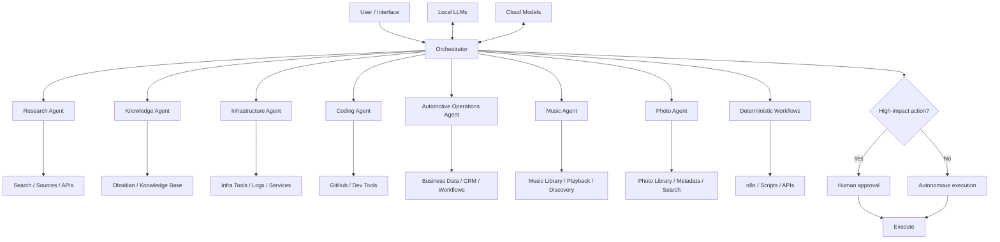

# Personal AI Infrastructure

This repo is a public-safe map of the AI stack I use for research, knowledge, infrastructure, coding, business operations, media and automation.

It is **not** the actual deployment repo. No secrets, no private configs, no production topology, no prompt dump. Just the architecture, the workflows and the ideas behind it.

The short version:

> Automate the boring stuff. Use agents where context matters. Let them run on their own most of the time. Ask for human approval only when the blast radius gets real.

## Why this exists

I use AI for a lot more than chat.

Some tasks are simple and repetitive. Some need context. Some need tools. Some need access to code, notes, infrastructure, business workflows, media libraries or external services.

Trying to make one giant assistant do all of that quickly turns into spaghetti.

So I split the system into a few specialized parts:

- one orchestrator,
- a set of focused agents,
- deterministic automations where rules are clear,
- local and cloud models depending on the job,
- and approval gates only for actions that can actually hurt something.

## The stack at a glance

## Main pieces

### Orchestrator

The orchestrator is the traffic controller.

It decides:

- what the task actually is,
- whether it should go to an agent or a deterministic workflow,
- which specialist should handle it,
- which model makes sense,
- which tools are needed,
- and whether the task is safe to run automatically.

It is not supposed to know everything. Its job is to route work well.

### Research agent

Used for messy, open-ended questions.

Typical jobs:

- compare technologies,
- research a problem,
- collect useful sources,
- summarize long material,
- find trade-offs,
- prepare a shortlist,
- turn research into something actionable.

### Knowledge agent

Keeps useful work from disappearing into chat history.

Typical jobs:

- retrieve relevant notes,
- connect new findings with older work,
- create summaries,
- update documentation,
- turn solved problems into reusable knowledge,
- keep the knowledge base from becoming a digital junk drawer.

### Infrastructure agent

Used for servers, containers, networking and self-hosted services.

Typical jobs:

- inspect logs,
- check health,
- diagnose failures,
- compare expected vs actual state,
- run safe checks,
- apply low-risk fixes,
- create troubleshooting notes.

It can operate autonomously for normal diagnostics and routine actions.

Approval is reserved for things with real impact: destructive changes, major network/security changes, risky production changes or actions that could cause downtime or data loss.

### Coding agent

Used for repository work and AI-assisted development.

Typical jobs:

- understand an unfamiliar codebase,
- locate the right implementation area,
- debug bugs,
- prepare patches,
- review diffs,
- work with Git history,
- write tests,
- update docs,
- connect technical work back to the original problem.

The point is not "AI writes code for me."

The point is that development becomes part of a larger system: problem → context → implementation → review → documentation.

### Automotive operations agent

This agent lives on the business side of the stack.

It is built around a real vehicle-sales workflow and helps with things such as:

- vehicle lifecycle tracking,
- CRM and lead handling,
- listing preparation,
- marketing drafts,
- partner and customer workflows,
- finance and reporting,
- keeping data consistent across several parts of the process.

The interesting bit is not the automotive domain itself.

It is that the agent sits between **real business operations and software**, where a lot of small manual steps can be replaced with structured workflows, automation and context-aware assistance.

Anything involving sensitive business data stays private and sanitized in this repo.

### Music agent

The music agent handles natural-language music requests and acts as a smarter layer on top of playback and discovery.

Typical jobs:

- understand requests that are not exact song titles,
- choose music based on mood, context or intent,
- translate natural language into playback actions,
- fall back to deterministic commands when the request is obvious,
- connect music control with automations and smart-home workflows.

Clear command like "play X"? No reason to burn tokens.

Something like "play something relaxed but not sleepy"? That is where the agent earns its keep.

### Photo agent

The photo agent is built around a private family photo collection.

Typical jobs:

- natural-language photo search,
- metadata search,
- face-aware retrieval,
- semantic search,
- visual descriptions,
- combining multiple weak signals into a useful result.

This is one of the main local-first use cases in the stack because photo libraries can contain extremely personal data.

The public repo only describes the architecture. No images, names, face data or private metadata are included.

## Agents vs deterministic workflows

One rule I keep coming back to:

> If a workflow can be expressed as a reliable rule, it probably does not need an LLM.

So:

- cron-like stuff stays deterministic,
- API glue stays deterministic,
- repeatable transformations stay deterministic,
- exact playback commands stay deterministic,
- structured business sync stays deterministic,
- ambiguous decisions go to agents,
- semantic search goes to agents/models,
- exceptions go to agents,
- weird edge cases go to agents.

This keeps the system faster, cheaper and easier to reason about.

## Local vs cloud models

I use both.

### Local models

Best fit when I care about:

- privacy,
- local data,
- low latency,
- offline use,
- local integrations,
- high-volume lightweight tasks.

### Cloud models

Best fit when I need:

- stronger reasoning,
- better coding,
- long context,
- stronger multimodal capability,
- advanced tool use.

The system is model-agnostic on purpose.

Models change fast. The architecture should survive the next model release.

## Integrations

At a high level, the system connects to tools such as:

- **Obsidian**
- **n8n**
- **GitHub**
- **MCP**
- **APIs**
- **Telegram**
- local services and self-hosted infrastructure
- business systems
- media libraries

The public repo only shows the shape of the system, not the keys to the kingdom.

## Example workflows

### Research → decision → knowledge

Ask a question, route it to research, compare sources, extract the useful bits, then save the result so the same work does not have to be rediscovered later.

### Infra issue → diagnose → fix → runbook

Collect evidence, inspect logs, narrow the cause, apply low-risk fixes automatically, escalate only if the next step has a real blast radius, verify the result and save the incident as a runbook.

### Business workflow → agent + automation

Structured data moves through deterministic workflows. The agent handles the fuzzy parts: drafting, context, prioritization, unusual cases and questions that do not fit a clean rule.

### Natural-language music request → playback

Exact command? Route it directly.

Messy human request? Let the music agent interpret it, choose something appropriate and hand the final action to the playback layer.

### Photo question → semantic retrieval

A vague request like "find photos from that winter trip where we were outside at night" can combine metadata, semantic search, face context and visual understanding without exposing the library publicly.

### Idea → prototype → repo

Turn a rough idea into requirements, build the smallest useful version, test it, commit it, document it and keep iterating.

### Manual task → automation

If the same task keeps appearing, move stable parts into n8n, scripts or direct API calls. Let the agent handle only the parts that still require judgment.

More detail: [WORKFLOWS.md](WORKFLOWS.md)

## Design rules

A few rules that keep the system sane:

- **Autonomous by default, approval-gated when impact is high.**
- **Deterministic first when the rules are obvious.**
- **Agents for ambiguity, not for everything.**
- **Local-first when privacy matters.**
- **Small specialized contexts beat one giant mega-prompt.**
- **Version everything important.**
- **Prefer reversible actions.**
- **Turn solved problems into documentation.**
- **Treat models as replaceable components.**
- **Build, test, observe, improve.**

## What is intentionally missing

This repository does not contain:

- API keys,
- credentials,
- private IPs,
- internal hostnames,
- VPN or remote-access config,
- full prompts,
- private agent instructions,
- exact permissions,
- personal notes,
- private photo data,
- customer or partner data,
- business-confidential data,
- production configs.

For the boring-but-important details, see [SECURITY.md](SECURITY.md).

## Docs

- [ARCHITECTURE.md](ARCHITECTURE.md) — how the system is wired
- [WORKFLOWS.md](WORKFLOWS.md) — how work moves through it
- [SECURITY.md](SECURITY.md) — what stays private and where approval kicks in

## Current rabbit holes

Things I am actively experimenting with:

- local LLMs,
- semantic search,
- RAG,
- multimodal input,
- agent orchestration,
- tool use,
- autonomous workflows,
- better memory,
- local/private photo intelligence,
- natural-language media control,
- business workflow agents,
- better boundaries between agents and deterministic automation.

The system is never really "finished".

That is kind of the point.
