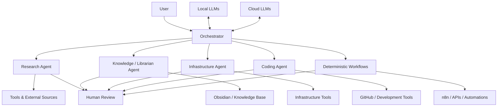

# Personal AI Infrastructure

A high-level architecture case study of the personal AI system I use to connect research, knowledge management, infrastructure work, software development and automation.

This repository intentionally focuses on **system design, workflows and lessons learned** rather than source code or private configuration.

## Why I built it

I use AI across very different kinds of work: researching a topic, maintaining technical notes, troubleshooting infrastructure, working with repositories, automating repetitive tasks and turning ideas into working tools.

A single general-purpose assistant quickly becomes hard to manage. Different tasks need different context, tools, permissions and levels of autonomy.

The system therefore follows a simple idea:

> Use deterministic automation when the rules are clear. Use agents when interpretation and context are required. Keep a human in the loop for important decisions.

## System at a glance

The system is organized around an **orchestrator** that receives a request, decides what kind of work is needed and delegates it to a specialized agent or deterministic workflow.

## Main components

### Orchestrator

The orchestrator is the main entry point. Its job is not to do everything itself, but to determine:

- what the user is trying to accomplish,
- whether the task is deterministic or agentic,
- which specialist has the right context and tools,
- whether local or cloud inference is more appropriate,
- and where human approval is required.

### Research agent

Used for open-ended research, source comparison and turning large amounts of information into practical recommendations.

Typical outputs include:

- research briefs,
- technology comparisons,
- implementation options,
- risk/benefit summaries,
- and structured notes for later use.

### Knowledge / librarian agent

Connects AI work with the personal knowledge base.

Typical responsibilities include:

- retrieving relevant context,
- organizing notes,
- preparing summaries,
- maintaining structured documentation,
- and turning completed work into reusable knowledge.

### Infrastructure agent

Focused on diagnostics and operational work around servers, networking, containers and self-hosted services.

The agent can help investigate a problem and prepare safe next steps, but important or destructive actions remain approval-gated.

### Coding agent

Used for repository analysis, implementation planning, debugging and AI-assisted development.

The goal is not autonomous code generation for its own sake. The useful part is connecting code work with the broader system: requirements, documentation, testing, Git history and real operational needs.

## Local and cloud models

The system deliberately uses both.

**Local models** are useful when privacy, low latency, local integrations or offline availability matter.

**Cloud models** are used when a task benefits from stronger reasoning, coding ability, larger context windows or specialized capabilities.

Routing between them is based on the task rather than using one model for everything.

## Integrations

At a high level, the system connects with tools such as:

- **Obsidian** for long-term knowledge and runbooks,
- **n8n** for deterministic automation and integrations,
- **GitHub** for repository and development workflows,
- **MCP / APIs** for structured tool access,
- **Telegram** and similar interfaces for lightweight interaction,
- local services and self-hosted infrastructure where appropriate.

No private endpoints, credentials or internal network details are included in this repository.

## Example workflows

A few representative workflows:

1. **Research → decision → knowledge**
   - A question is routed to research.
   - Sources are compared and summarized.
   - The result is reviewed.
   - Useful conclusions are converted into a permanent note or project plan.

2. **Infrastructure incident → diagnosis → runbook**
   - Symptoms and logs are collected.
   - The infrastructure agent narrows the likely causes.
   - Commands or changes are proposed one step at a time.
   - Risky actions require approval.
   - The resolution becomes reusable troubleshooting documentation.

3. **Idea → prototype → repository**
   - An idea is clarified into requirements.
   - The coding workflow creates or modifies an implementation.
   - GitHub is used for versioned changes and review.
   - Documentation is updated alongside the implementation.

4. **Repeated process → deterministic automation**
   - If a workflow becomes predictable, it is moved away from an LLM where practical.
   - n8n, scripts or APIs handle repeatable steps.
   - AI remains only where judgment or unstructured input is useful.

More detail is available in [WORKFLOWS.md](WORKFLOWS.md).

## Design principles

- **Deterministic first** when rules are known.
- **Agents for ambiguity**, not for every task.
- **Human approval for consequential actions.**
- **Least necessary access** to tools and data.
- **Local-first when privacy matters.**
- **Documentation is part of the workflow**, not an afterthought.
- **Small specialized contexts** are easier to control than one giant assistant.
- **Build, observe, improve** rather than trying to design the perfect system up front.

## What this repository does not contain

This is intentionally not a deployment repository.

It does **not** include:

- API keys or credentials,
- system prompts or private agent instructions,
- private IP addresses or internal domains,
- VPN or remote-access configuration,
- exact permission policies,
- personal knowledge-base content,
- confidential business data,
- production configuration files.

See [SECURITY.md](SECURITY.md) for the publication boundary.

## Documentation

- [ARCHITECTURE.md](ARCHITECTURE.md) — components, routing and model strategy
- [WORKFLOWS.md](WORKFLOWS.md) — representative end-to-end workflows
- [SECURITY.md](SECURITY.md) — what is intentionally kept private

## Status

This system is continuously evolving. Current areas of experimentation include local LLMs, semantic search, retrieval, multimodal models, agent/tool orchestration and better boundaries between autonomous and deterministic workflows.
