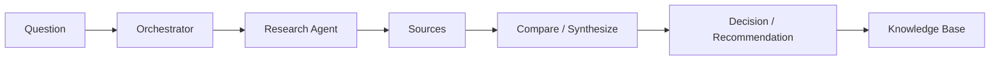
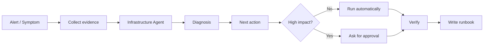
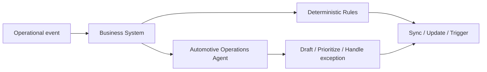
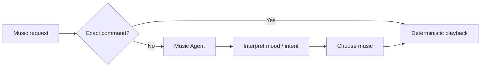
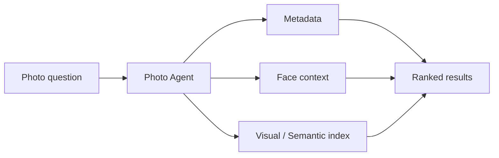
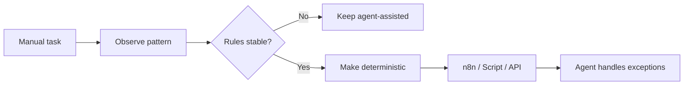

# Workflows

A few examples of how work moves through the system.

These are intentionally high-level and sanitized.

No private infra details. No credentials. No "copy this and own my network" section.

## 1. Research → decision → knowledge

### Goal

Turn a vague question into something useful.



### What happens

1. The question gets routed to research.
2. The agent collects useful sources.
3. It compares the important differences.
4. It strips away noise.
5. It recommends what is worth testing.
6. The useful result gets saved as reusable knowledge.

Most of this runs autonomously.

Human input is useful when there is an actual decision to make, not because every intermediate step needs supervision.

---

## 2. Infra problem → diagnose → fix → runbook

### Goal

Fix things without turning automation into a loaded gun.



### Normal behavior

The agent can autonomously:

- inspect logs,
- query service state,
- run health checks,
- compare configs,
- test connectivity,
- perform routine reversible fixes,
- verify whether the issue is resolved.

Approval is only needed when the next step could:

- delete data,
- break networking,
- affect security,
- cause downtime,
- touch production in a risky way,
- affect accounts or money.

That keeps the workflow fast without pretending risk does not exist.

---

## 3. Business operations → structured workflow + agent

### Goal

Use AI where human-ish context helps without turning the whole business system into a chatbot.



### Typical split

Deterministic layer:

- state changes,
- data synchronization,
- validation,
- calculations,
- known triggers,
- repeatable API calls.

Agentic layer:

- draft customer-facing content,
- reason about unusual cases,
- summarize history,
- prioritize follow-up,
- help with partner/customer context,
- explain what needs attention.

The business process stays structured. The agent fills the gaps where rigid rules get awkward.

---

## 4. Natural-language music request → playback

### Goal

Make music control feel human without making simple commands unnecessarily complicated.



Examples:

```text
"Play Artist - Song"
→ direct playback

"Give me something chill for the terrace"
→ interpret context → choose → play
```

The agent deals with taste, ambiguity and context.

The playback layer stays deterministic.

---

## 5. Photo question → private semantic search

### Goal

Search a large personal photo library in normal language.



The query might contain a mix of:

- rough date,
- people,
- place,
- event,
- visual content,
- vague memory.

The photo agent combines those signals instead of requiring perfect tags.

Because the source is personal, the design is local-first where practical.

No actual personal photo data belongs in this repo.

---

## 6. Idea → prototype → repo

### Goal

Turn "what if..." into working software quickly.

### Flow

1. Capture the idea.
2. Define the smallest useful version.
3. Identify constraints.
4. Inspect the relevant repo.
5. Build.
6. Test.
7. Fix what broke.
8. Commit.
9. Update docs.
10. Repeat.

The coding agent can handle most of this on its own inside the repository.

A human only needs to step in when the change crosses an important boundary: deployment, destructive behavior, sensitive systems or a major product decision.

---

## 7. Repeated task → deterministic automation

### Goal

Stop wasting LLM tokens on jobs that are basically a shell script wearing sunglasses.



A workflow might start agentic because the rules are unclear.

After enough repetitions, patterns appear.

Then:

- known cases become rules,
- edge cases stay agentic,
- cost drops,
- latency drops,
- debugging gets easier.

---

## 8. Knowledge capture after real work

### Goal

Make sure the next version of me does not have to rediscover the same fix six months later.

After a useful task is completed, the system can store:

- the original problem,
- relevant context,
- what was tried,
- what failed,
- what worked,
- how it was verified,
- what should happen next.

That becomes a note, runbook or project decision.

Useful especially for:

- infrastructure incidents,
- weird bugs,
- architecture decisions,
- experiments,
- one-off setup procedures.

---

## 9. Local AI for private technical work

### Goal

Keep some workloads close to the data.

A local client talks to a local model endpoint.

Useful for:

- local notes,
- private context,
- quick technical questions,
- experimentation,
- offline use,
- lightweight high-volume tasks,
- sensitive personal media workflows.

If the task becomes too hard for the local model, the orchestrator can route it to a stronger cloud model when appropriate.

The user should not need to manually babysit model selection every time.

---

## 10. Agent-assisted development

### Goal

Use AI like a technical teammate, not a slot machine.

Typical loop:

1. inspect repo,
2. understand issue,
3. identify relevant files,
4. propose or make a change,
5. inspect diff,
6. run tests/checks,
7. fix failures,
8. commit,
9. update docs.

Routine work can be autonomous.

Higher-risk steps such as deployment or destructive production changes remain gated.

---

## 11. Lightweight control from messaging

Not every task needs a full dashboard.

A messaging interface can be enough for:

- checking status,
- triggering known workflows,
- receiving summaries,
- seeing alerts,
- requesting music,
- approving the occasional high-impact action.

The messaging layer is an interface, not unrestricted admin access.

---

## 12. Autonomous workflow chain

A typical autonomous chain can look like this:

```text
trigger
  ↓
orchestrator
  ↓
specialist agent
  ↓
tools / APIs
  ↓
verification
  ↓
documentation
```

If every step stays inside low-risk boundaries, no human intervention is needed.

If the workflow hits a high-impact step, it pauses and asks.

That is the autonomy model in one sentence:

> Run freely inside the sandbox. Ask before kicking down a wall.

## Workflow rule of thumb

| Situation | Best fit |
|---|---|
| Clear rules | Deterministic automation |
| Messy input | Agent |
| Routine low-risk task | Autonomous |
| Reversible technical fix | Usually autonomous |
| Business exception / prioritization | Agent |
| Vague music request | Agent |
| Exact playback command | Deterministic |
| Personal photo retrieval | Local-first agent/search |
| Complex reasoning | Agent |
| External action with consequences | Approval |
| Destructive infra change | Approval |
| Stable repeated agent decision | Turn it into a rule |

The goal is not "more agents."

The goal is fewer stupid manual steps.
