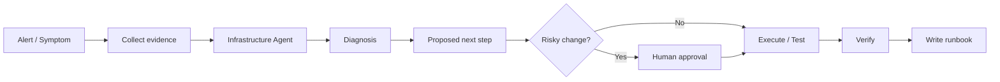
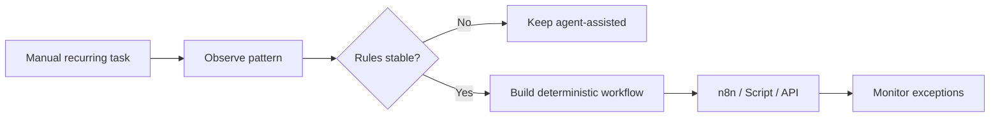

# Workflows

This document shows representative workflows from the system. They are intentionally described at a high level and do not expose private configuration, credentials or internal infrastructure details.

## 1. Research → decision → knowledge

### Goal

Turn an open question into a useful decision and preserve the result for later.

### Flow

### Example

A new model, framework or self-hosted tool looks interesting.

The system can:

1. clarify what problem the tool might solve,
2. research documentation, benchmarks and community feedback,
3. compare it with the current setup,
4. extract practical trade-offs,
5. propose a small test,
6. save the conclusion as reusable project knowledge.

The important part is that research should end in an action or documented decision, not just another pile of links.

---

## 2. Infrastructure incident → diagnosis → runbook

### Goal

Troubleshoot methodically without giving an agent unrestricted operational control.

### Flow

### Principles

- collect evidence before changing things,
- work one diagnostic step at a time,
- prefer reversible actions,
- separate observation from remediation,
- require confirmation for destructive or security-sensitive changes,
- document the final cause and fix.

This turns one incident into knowledge that reduces future troubleshooting time.

---

## 3. Idea → prototype → repository

### Goal

Move quickly from an idea to something testable without skipping structure.

### Flow

1. Capture the idea in plain language.
2. Define the smallest useful outcome.
3. Identify constraints and dependencies.
4. Let the coding agent inspect the relevant repository or prepare a new implementation plan.
5. Build a small working version.
6. Test against the original problem.
7. Commit the change with documentation.
8. Record what worked, what failed and what should happen next.

### Where AI helps

AI is useful for:

- turning rough ideas into requirements,
- codebase navigation,
- implementation options,
- debugging,
- test generation,
- documentation,
- reviewing changes.

The human still decides whether the result actually solves the real problem.

---

## 4. Repeated manual task → deterministic automation

### Goal

Avoid using an LLM for work that has become predictable.

### Flow

### Example pattern

A workflow may start as:

> "Read this input, decide what category it belongs to, then do the correct action."

After enough use, most categories may become deterministic.

At that point:

- fixed rules handle known cases,
- the agent only sees ambiguous exceptions,
- cost and latency drop,
- behavior becomes easier to test.

This is one of the main architectural ideas behind the system.

---

## 5. Knowledge capture after completed work

### Goal

Prevent useful solutions from disappearing inside chat history.

### Flow

After a meaningful task is completed, the knowledge workflow can create a concise record containing:

- the original problem,
- relevant context,
- what was tested,
- what failed,
- the final solution,
- verification steps,
- follow-up work.

The result is stored in a structured knowledge base such as Obsidian.

This is particularly useful for infrastructure incidents, project decisions and recurring technical procedures.

---

## 6. Local AI for private technical assistance

### Goal

Use AI close to the data when cloud processing is unnecessary or undesirable.

### Flow

A local client or tool sends a request to a local model endpoint.

Typical uses include:

- quick technical questions,
- working with local notes,
- experimentation,
- private context,
- offline or low-latency assistance.

For harder reasoning or coding tasks, the orchestrator can instead route the problem to a stronger cloud model.

The user does not need to think in terms of "which model should I use?" for every task. Model choice becomes part of the workflow.

---

## 7. Agent-assisted development with human review

### Goal

Use AI as an active development partner while preserving control over production changes.

A typical sequence is:

1. inspect the repository,
2. understand the issue,
3. propose the implementation,
4. make a versioned change,
5. inspect the diff,
6. run available tests or checks,
7. review the result,
8. merge or deploy only after approval.

This keeps development fast while retaining traceability through Git and explicit review points.

---

## 8. Notification and lightweight interaction

Not every interaction needs a full desktop interface.

A lightweight messaging interface can be useful for:

- receiving summaries,
- triggering known workflows,
- checking status,
- approving a proposed action,
- getting alerts from automated processes.

The messaging layer should remain an interface, not an unrestricted administrative backdoor.

---

## Workflow design rule

A useful way to decide how much autonomy a workflow should have is:

| Situation | Preferred approach |
|---|---|
| Clear rules, stable inputs | Deterministic automation |
| Unstructured input, low-risk output | Agent can act more independently |
| Complex reasoning, reversible result | Agent + review |
| External communication | Draft first, confirm before sending |
| Infrastructure write action | Diagnose first, confirm before change |
| Destructive or security-sensitive action | Explicit human approval |
| Repeated agent decision becomes predictable | Convert it into a rule |

The objective is not to maximize the number of agents. It is to use the simplest reliable mechanism for each part of the system.
